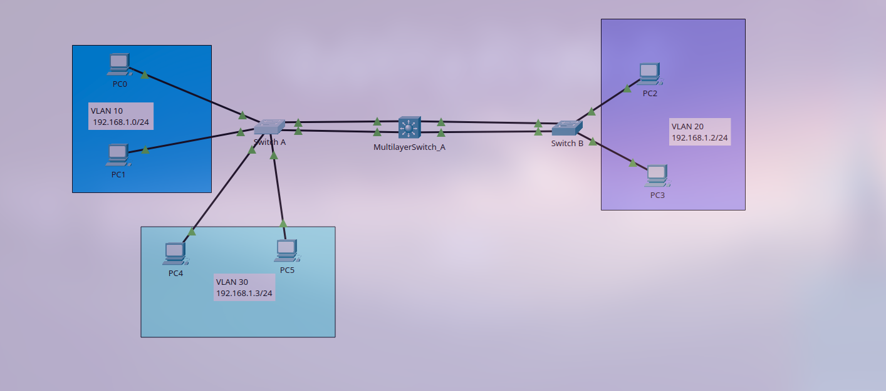

# Inter-VLAN Routing implementation using Multilayer Switches
# Inter-VLAN Routing with a Layer 3 Switch

## Project Highlights
This project demonstrates several key networking concepts:
* **VLANs**: The network is segmented into three separate Virtual Local Area Networks (VLANs) to improve security and performance.
* **Layer 3 Switching**: A multilayer switch is used as the central point for routing traffic between the different VLANs.
* **Trunking**: The links connecting the access switches to the multilayer switch are configured as trunks to carry traffic from all three VLANs.
* **EtherChannel**: Link aggregation is used to bundle multiple physical links into a single logical link, providing increased bandwidth and redundancy.
* **LACP**: The Link Aggregation Control Protocol is used to automatically manage the EtherChannel bundles.

## Network Topology
The network is designed with three VLANs, each with its own subnet and a default gateway configured on the multilayer switch.

**VLAN 10**: `192.168.1.0/24` | **VLAN 20**: `192.168.2.0/24` | **VLAN 30**: `192.168.3.0/24`

## Configuration Details

### End devices
| Device | VLAN | IP address | Network | Default Gateway | Connected Switch | Access port |
|---|---|---|---|---|---|---|
| PC0 | 10 | 192.168.1.2/24 | 192.168.1.0 /24 | 192.168.1.1/24 | Switch_A | Fa0/1 |
| PC1 | 10 | 192.168.1.3/24 | 192.168.1.0 /24 | 192.168.1.1/24 | Switch_A | Fa0/2 |
| PC2 | 20 | 192.168.2.2/24 | 192.168.2.0 /24 | 192.168.2.1/24 | Switch_B | Fa0/1 |
| PC3 | 20 | 192.168.2.3/24 | 192.168.2.0 /24 | 192.168.2.1/24 | Switch_B | Fa0/2 |
| PC4 | 30 | 192.168.3.2/24 | 192.168.3.0 /24 | 192.168.3.1/24 | Switch_A | Fa0/5 |
| PC5 | 30 | 192.168.3.3/24 | 192.168.3.0 /24 | 192.168.3.1/24 | Switch_A | Fa0/6 |

### Switches
| Switch | Connected device | Switch port |
|---|---|---|
| Switch_A | MultilayerSwitch_A | Fa0/3, Fa0/4 |
| Switch_B | MultilayerSwitch_A | Fa0/3, Fa0/4 |

### MultilayerSwitch_A
| Switch | Switch port |
|---|---|
| Switch_A | Fa0/1, Fa0/2 |
| Switch_B | Fa0/3, Fa0/4 |

### Etherchannel
| Port-channel | Switches | Ports | Mode |
|---|---|---|---|
| 1 | Switch_A | Fa0/3, Fa0/4 | LACP - Active |
| | MultilayerSwitch_A | Fa0/1, Fa0/2 | |
| 2 | Switch_B | Fa0/3, Fa0/4 | LACP - Active |
| | MultilayerSwitch_A | Fa0/3, Fa0/4 | |

### Trunk Links
| Switch | Trunk | Allowed VLANs |
|---|---|---|
| Switch_A | Port channel 1 | VLAN 10, VLAN 20, VLAN 30 |
| Switch_B | Port channel 2 | VLAN 10, VLAN 20, VLAN 30 |
| MultilayerSwitch_A | Port channel 1 & Port channel 2 | VLAN 10, VLAN 20, VLAN 30 |

## Cisco CLI Configuration
_Note: The `show run` outputs and copy buttons from the HTML file cannot be directly replicated in Markdown. You can paste the code blocks below as preformatted text._

### Switch_A `show run` Output
Current configuration : 1697 bytes
                        !
                        version 15.0
                        no service timestamps log datetime msec
                        no service timestamps debug datetime msec
                        no service password-encryption
                        !
                        hostname Switch_A

                        !
                        no ip domain-lookup
                        !
                        spanning-tree mode pvst
                        spanning-tree extend system-id
                        !
                        interface Port-channel1
                         switchport trunk native vlan 99
                         switchport trunk allowed vlan 10,20,30
                         switchport mode trunk
                        !
                        interface FastEthernet0/1
                         switchport access vlan 10
                         switchport mode access
                        !
                        interface FastEthernet0/2
                         switchport access vlan 10
                         switchport mode access
                        !
                        interface FastEthernet0/3
                         switchport trunk native vlan 99
                         switchport trunk allowed vlan 10,20,30
                         switchport mode trunk
                         channel-group 1 mode active
                        !
                        interface FastEthernet0/4
                         switchport trunk native vlan 99
                         switchport trunk allowed vlan 10,20,30
                         switchport mode trunk
                         channel-group 1 mode active
                        !
                        interface FastEthernet0/5
                         switchport access vlan 30
                         switchport mode access
                        !
                        interface FastEthernet0/6
                         switchport access vlan 30
                         switchport mode access
                        !
                        interface FastEthernet0/7
                        !
                        !
                        interface FastEthernet0/23
                        !
                        interface FastEthernet0/24
                        !
                        interface GigabitEthernet0/1
                        !
                        interface GigabitEthernet0/2
                        !
                        interface Vlan1
                         no ip address
                         shutdown
                        !
                        line con 0
                         exec-timeout 30 0
                        !
                        line vty 0 4
                         login
                        line vty 5 15
                         login
                        !
                        !
                        end
              
